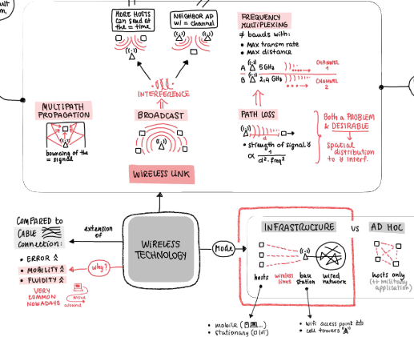

## 🎓 Educational Content & Visual Learning Aids
Welcome!
This folder is a collection of the teaching materials and visual learning aids I created during my university years, many of which were originally shared with fellow students in Telegram groups to help with exam prep.

I also used most of these resources for tutoring sessions, both in class and one-on-one, and they were quite well received by the students. Over time, they became my personal way of making complex concepts more accessible, engaging, and memorable.

### 🧠 What You'll Find
This folder includes a variety of visual materials I’ve used for teaching and learning:
- 🗺️ Mind maps: connect core ideas across
- 🧮 Problem-solving diagrams: to break down algorithmic thinking into intuitive steps
- 🌀 Infinite canvas: in depth notes that zoom out to reveal big-picture structure and flow
- 🧾 Annotated materials: from real tutoring sessions and group study meetups
###

### 💬 A Personal Note
> Hi! My name is Beatrice, and I recently graduated in Computer Engineering with a specialization in Artificial Intelligence. Throughout my studies, I found myself constantly exploring new topics. Like many self-learners, I’ve always relied on the generosity of others who share their work freely online. Every time I discovered a clear, thoughtful explanation or beautifully designed resource, it felt like a small gift — and it inspired me to give back!

> These materials are my way of doing just that. I poured a lot of care into them over the years. They’re not perfect, but they’re real — created with the hope that they might make someone's study session a bit easier, or spark a new insight. I’ve always believed in collaboration and peer support, and I hope to keep working in education and research. This project is a small step in that direction.

> So if you’re here studying: good luck! Take these words as a small encouragement. Even if we’ve never met, I’m cheering you on. And don’t forget to enjoy the process.

