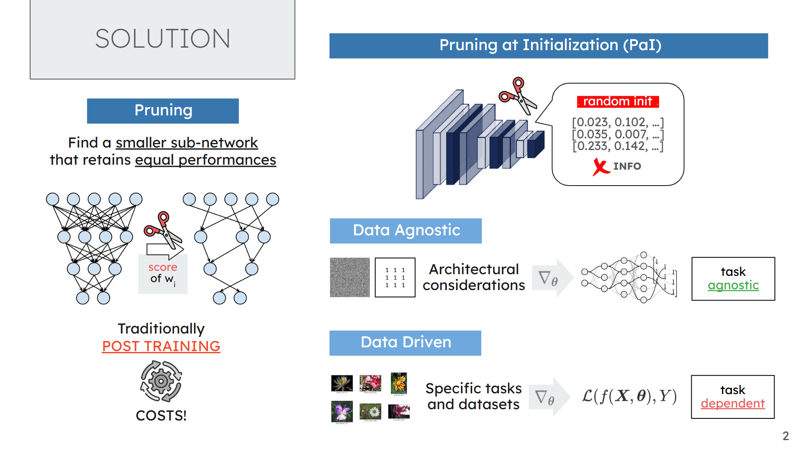
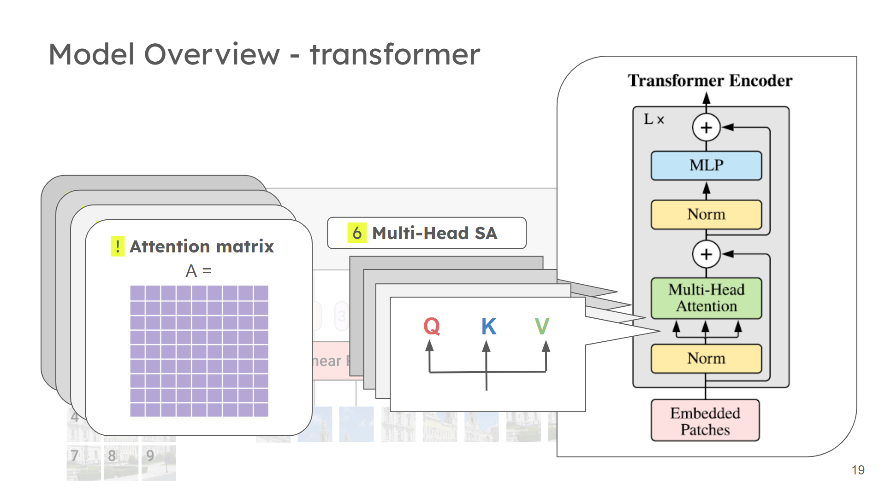
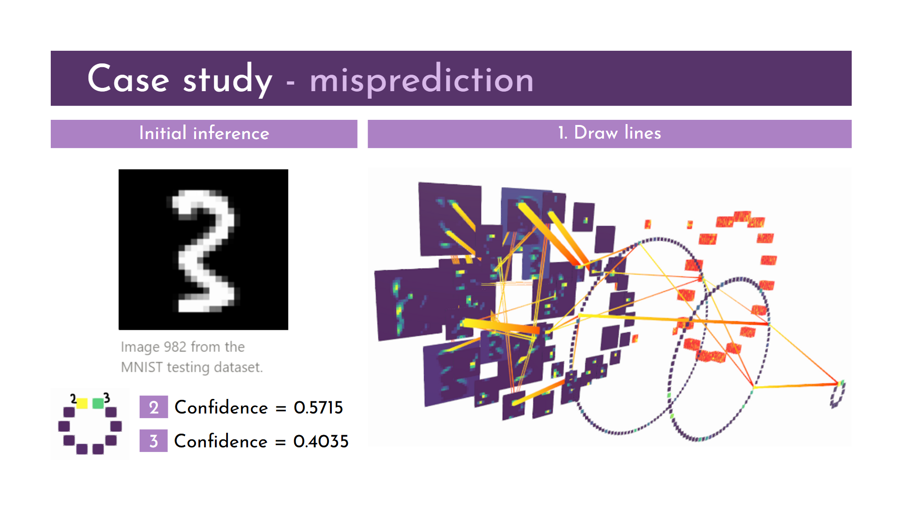
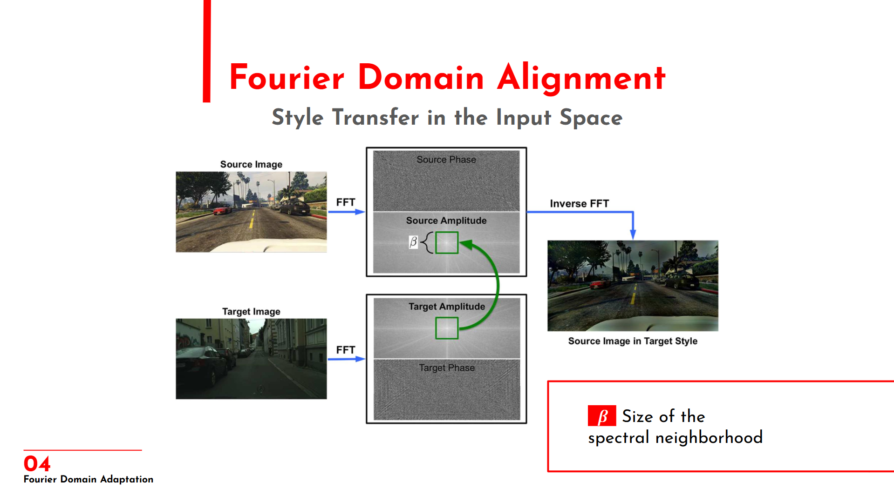
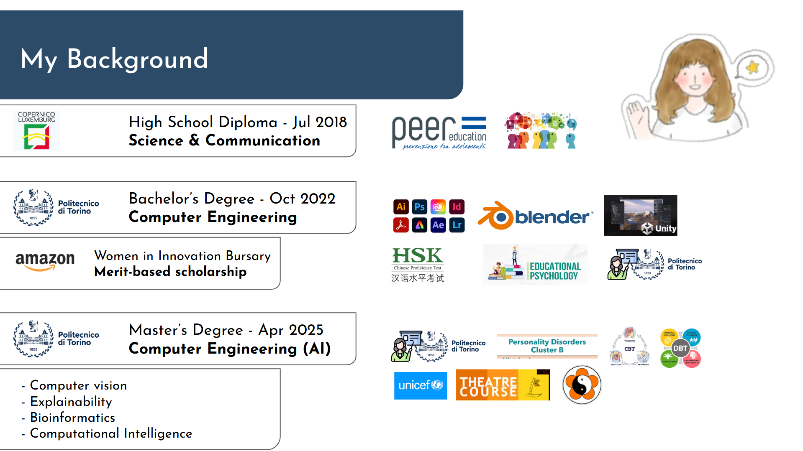

## 📽️ Academic Slideshows & Presentations
Welcome to the Slideshows section of my portfolio!
This folder gathers a selection of digital presentations I’ve created and used in academic and professional settings, including coursework, seminars, and collaborative research.

These presentations reflect a **more structured and polished style**, aimed at clearly communicating complex topics while maintaining a visually engaging format. Whether the audience was fellow students, professors, or lab colleagues, my goal was always to make the subject matter feel accessible, well-paced and memorable.

- [Master’s Thesis Defense: A Second-Order Perspective on Pruning-at-Initialization](https://docs.google.com/presentation/d/1fGBfLeY2q-a3hvfrVpm-GIxPzF8Js3MPFwXUs9OwsBU/edit?usp=sharing)

    

    My visually rich presentation on neural network pruning, exploring theoretical perspectives on loss landscapes through second-order approximations, curvature analysis, and intuitive visualizations of the loss surface.

- [ViTs Paper Presentation](https://docs.google.com/presentation/d/13HXR_C3_o9S4yvyv1S0GmJmCG3nnE47ctqD-tXYVA0k/edit?usp=sharing)

    

    A clear and engaging breakdown of the original Vision Transformers (ViT) paper, developed as part of a group assignment. I focused on analyzing the core architecture, training strategies, and key innovations, and presented the main concepts to our class in a way that was both accessible and compelling.

- [Explainable CNNs: A 3D Interactive Tool in Unity](https://docs.google.com/presentation/d/1nuo_LBCqdWlipj3f42O4tgDIZAJHHyaB/edit?usp=sharing&ouid=113543946159232077171&rtpof=true&sd=true)

    

    A brief overview of an interactive 3D visualization tool for exploring the inner workings of Convolutional Neural Networks (CNNs) that I helped develop. The tool allows real-time exploration of CNN decision-making, with visualizations of neurons, synapses, and model robustness through fault injection experiments. It serves as both a research analysis tool and an interactive learning platform for students.

- [Real-Time Domain Adaptation in Semantic Segmentation ](https://docs.google.com/presentation/d/1Vp3L4GpOCRAzBfPYN-bUmcENdN4BJ93ZWn9nXM4h7Ew/edit?usp=sharing)

    

    A final project presentation for the Advanced Machine Learning course. We studied key approaches from the literature, ran experiments, and evaluated model performance. As an optional extension, we explored Fourier Domain Alignment for input-space style transfer. The goal was to present our results and observations clearly and effectively as part of the oral exam.

- [Personal Presentation](https://docs.google.com/presentation/d/1uzE07D8qlU8RZoE08yQzkjiQF8m-NMyutZkuosf_WZQ/edit?usp=sharing)

    

    A brief self introduction offering a quick overview of my background, key experiences, and main areas of interest — designed to present who I am and what drives my work.